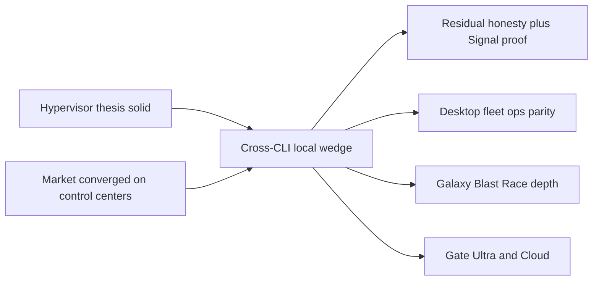

# Pytxo deep-improvement research

Primary-source synthesis (vault + crates + 2026 competitor docs). Longer than an atomic note by design — market landscape plus ranked program for the next cycle.

## Executive verdict

Pytxo is **past MVP as a local agent hypervisor**. [[mvp-bootstrap]] Phases 0–73 are largely shipped: Signal Core, Blast (worktree + sparse copy-layer), Race (`SwarmRegistry` + Galaxy HITL), permission profiles, Desktop 2, MCP, Ultra **local** wallet, and Phase 73 proof pins.

The 2026 market has **converged on parallel agents + sandbox + control-center UX**. That makes “we have multi-agent” and “we have a sandbox” table stakes — not moats. Pytxo’s wedge is the **local multi-CLI hypervisor**: heterogeneous agents you already run, Race write-collision control, Signal structural context, and honest approve-to-flush — not another vendor control center.

Phase 73 closed several narrative gaps (pinned benchmarks, caveated ~60%, Focus arbitrage bar, vision lock-free/3D/languages wording). Residual risk is **leftover overclaim** (glossary 3D-primary, Ultra/Cloud “shipped,” ProjFS-as-default) plus **supervision parity** with Copilot App / Cursor cloud UX.

### Locked product directions (this cycle)

1. **Desktop primary surface** = Desktop 2 structural Focus (`FocusScreen.svelte`), not Three.js 3D. Legacy shell only when `desktop_shell_v1=true`.
2. **Proof + trust** over category features. Keep measured Signal pins next to aspirational ~60%; finish residual honesty surfaces.
3. **Blast production interim** = sparse copy-layer (`projfs-sparse-copy-v2`). Kernel ProjFS/FUSE and OS Seatbelt/bwrap parity are dated north stars — not shipping claims.
4. **Ultra/Cloud capability-gated** until Link reconcile and cloud dispatch are non-noop. Local ledger remains honest.
5. **Race Shield + Galaxy HITL** are the Claude-teams collision answer Claude’s own docs admit; deepen beyond string classifiers.
6. **Do not race** Copilot Agent Merge, Cursor cloud artifacts, or Jules PR fleets as near-term shipping claims.

## Market landscape (2026-07-23)

| Product | Category | Multi-agent | Sandbox | Context | Local-first | BYOK |
|---------|----------|-------------|---------|---------|-------------|------|
| **Pytxo** | Local agent hypervisor | Heterogeneous CLI fleets | Blast approve-to-flush + permission profiles | Signal Core AST skeletons | Yes | Yes (local surfaces) |
| **Claude Agent Teams** | Claude Code teams | Lead + mailbox; experimental `CLAUDE_CODE_EXPERIMENTAL_AGENT_TEAMS=1` | Inherit lead perms; **no worktree isolation** | Separate windows; no lead history carryover | Local sessions | Anthropic account |
| **OpenAI Codex** | Coding agent | Single-agent focus in sandbox docs | Seatbelt / bwrap+seccomp / Windows token; network off default | Workspace + writable roots | Strong local + cloud containers | OpenAI / ChatGPT surfaces |
| **Cursor Cloud Agents** | Cloud VM agents | Many parallel; multi-repo | Isolated VMs; egress allowlists | Full env + MCP + artifacts | No (cloud) | Curated models; API pricing |
| **GitHub Copilot app** | Agent desktop control center | Parallel sessions; My Work; Agent Merge | Local + cloud sandboxes; **git worktree per session** | Issues/PRs; canvases | Hybrid | Copilot seat (not raw BYOK) |
| **Google Jules** | Async cloud agent | Plan → VM → PR | Short-lived cloud VM | Repo + `AGENTS.md` | No | Google account |
| **Aider / OpenHands / Factory** | Adjacent | Pair / platform / Missions (preview) | None / Docker / product sandboxes | Repo-map / workspace / AGENTS.md | Varies | Often yes on CLI |

**Safe wedge claims:** cross-CLI hypervisor; Race vs Claude’s documented same-file overwrite gap; Signal as cost control; local-first + BYOK on local surfaces.

**Unsafe claims:** unique multi-agent; unique sandbox; invented worktrees; local-first beats cloud on VM demo capability; BYOK everywhere; Landlock as Pytxo’s Linux story.

Deep compares: [[pytxo-vs-claude-agent-teams]], [[pytxo-vs-github-copilot-app]], [[multi-agent-orchestration-landscape]].

## Architecture maturity matrix

| Surface | Maturity | Shipping evidence | Gap |
|---------|----------|-------------------|-----|
| **Signal Core** | High | 8+ grammars; closed-loop; MCP scaffolded reads; Phase 73 pin **4.76%** on tiny fixture | Large-file ~60% still aspirational; symbol-level escalation incomplete |
| **Blast Shield** | Medium–high MVP | Worktree + sparse copy-layer default (Phase 69) | No mmap CoW; no Seatbelt/bwrap parity; ProjFS/FUSE north star |
| **Race Shield** | High for claims/stdin | Locked `SwarmRegistry`; Galaxy HITL queue | Not lock-free; string HITL classifiers; no syscall intercept |
| **Permission profiles** | Medium–high | `PermissionEngine` FS/network/env; DeepSpace isolation | `ProcessPolicy` docs-only; Orbit allowlist TBD; WFP often stub |
| **Ultra billing** | Local high / cloud low | SQLite wallet | Default `NoopBillingReconciler`; Link ping-only stub |
| **Pytxo Cloud** | Low | Trait + `HttpCloudDispatcher` | Default `NoopCloudDispatcher`; gVisor/Kata deferred |
| **Desktop 2** | High for Ops/Flow/HITL/Focus | Default shell; Focus arbitrage bar (Phase 73) | No live Ops poll; fleets loaded unused; Integrations stubs; Settings “Coming soon” |
| **MCP / CLI** | High surface / thin tests | Wired to orchestrate | Zero dedicated integration tests |

## Doc-vs-code mismatches

| Claim | Status (2026-07-23) |
|-------|---------------------|
| Vision lock-free / 5-language / 3D primary | **Fixed Phase 73** in [[product-vision]] — locked registry, 8+, Desktop 2 Focus |
| Competitive TBD cells | **Fixed Phase 73** pins in [[competitive-benchmarks]] (methodology caveats remain) |
| Focus without arbitrage | **Fixed Phase 73** — Focus surfaces savings bar |
| Duplicate ADR-0014 | **Fixed** — Chroma → [[ADR-0029-chroma-shared-design-tokens]] |
| Glossary / presentation / three-tier “3D primary” | **Open** — residual honesty pass |
| Sparse-overlay leads with FUSE/ProjFS | **Open** — lead with copy-layer shipping |
| Ultra/Link / Enterprise sandboxes “Shipped/GA” in tiers | **Open** — vs Noop reconciler/dispatcher |
| Hybrid-execution as live default path | **Open** — Noop dispatcher caveat needed |
| Fleet panel in Desktop 2 | **Open** — CLI/MCP real; Desktop UI Phase 74 |
| MCP Integrations in-app config | **Open** — hub is CLI/`pytxo-mcp` |
| `ProcessPolicy` trait | **Open** — documented only |

## Ranked improvement program

Market leverage maps onto engineering phases: Race + isolation honesty (Claude/Copilot), control-center UX (Copilot/Cursor), Blast/permissions honesty (Codex), Signal cost proof (Claude token warning), Ultra/Cloud gate (don’t fake Jules/Cursor cloud).

### P0 — Residual trust and GTM honesty

| # | Action | Surface | Why |
|---|--------|---------|-----|
| 1 | Finish honesty pass: glossary, presentation, three-tier, sparse-overlay, hybrid, tiers, GTM | Vault + public mirrors | Codex/Copilot sell real sandboxes; overclaim kills trust |
| 2 | Keep Signal pin + aspirational ~60%; prefer large-file repro before stronger marketing | [[competitive-benchmarks]], [[signal-core]], feature-grid | Claude teams warn of token multiplication |
| 3 | Frame proof targets vs Copilot App / Codex, not ADE walls alone | [[competitive-benchmarks]], [[beyond-the-ade]] | Category peers shifted |

### P1 — Supervision parity (Desktop 2)

| # | Action | Surface | Why |
|---|--------|---------|-----|
| 1 | Live Ops refresh (~1s poll) | `DesktopShell.svelte` | Copilot “My Work” / Cursor agent pages set table stakes |
| 2 | Fleet panel from `snapshot.fleets` **or** keep CLI-only claims | Desktop 2 + public docs | Data loaded; UI or claims must match |
| 3 | Integrations = CLI/Cursor MCP truth (no stub cards) | `CollectionScreen.svelte` | Hub is real in `pytxo-mcp` |
| 4 | Finish or remove Settings “Coming soon” | `CollectionScreen.svelte` | Dead nav erodes trust |
| 5 | Make Approvals / Blast flush as visible as competitor plan gates | Approvals + Focus | Jules/Codex/Claude all teach approve-before-write |

### P2 — Moat depth

| # | Action | Surface | Why |
|---|--------|---------|-----|
| 1 | Galaxy HITL beyond command-string classifiers | `hitl_gate.rs` | Enterprise vs Claude teams collision gap |
| 2 | DeepSpace fail-closed on WFP stub | `network_isolation.rs` | Don’t silently stub air-gap |
| 3 | Implement or delete `ProcessPolicy` | [[permission-profile-engine]] | Docs/code parity vs Codex profiles |
| 4 | Race profiling → shards only if needed | `race.rs` | Avoid premature lock-free rewrite |
| 5 | Linux overlay CI; copy-layer fallback; date OS-sandbox north star | Blast / overlay crates | Honest vs Seatbelt/bwrap — don’t claim parity |

### P3 — Reliability and commercial gates

| # | Action | Surface | Why |
|---|--------|---------|-----|
| 1 | Integration tests for `pytxo-cli` and `pytxo-mcp` | Those crates | Primary surfaces untested |
| 2 | Ultra = local-ledger-only until Link E2E | `NoopBillingReconciler` | Stop implying live meter |
| 3 | Cloud = configured dispatcher only; demote Max sandbox GA language | `NoopCloudDispatcher`, [[hybrid-execution]] | Don’t race Cursor/Jules VMs |
| 4 | Async PR handoff / Agent Merge parity | North star only | Copilot/Jules ship this; Pytxo must not fake it |

## Explicit non-goals (next cycle)

- ADE-like terminal walls ([[beyond-the-ade]])
- Matching Copilot **Agent Merge** or Cursor cloud artifact demos as shipping claims
- Claiming Seatbelt / Landlock / bwrap parity before code exists
- Lock-free Race rewrite before contention profiles
- Firecracker / gVisor multi-tenant near-term (ADR-0025 deferred)
- Treating Aider / OpenHands / Factory as head-to-head category peers (adjacent only)

## How to use this note

[[mvp-bootstrap]]: **73 shipped** (proof pins + vision honesty). **74–76** = P1 Desktop supervision, P2 moat depth, P3 reliability/commercial.

- **Product / GTM:** residual P0 honesty + compare guides; then Phase 74.
- **Desktop:** Phase 74 + [[desktop-ui-improvement-backlog]] (Focus remains primary).
- **Orchestration:** Phases 75–76; declare permission profile + execution domain per [`AGENTS.md`](../../AGENTS.md).

## Sources (accessed 2026-07-23)

- Claude Agent Teams: https://code.claude.com/docs/en/agent-teams · https://code.claude.com/docs/en/agents
- Codex sandbox / approvals: https://developers.openai.com/codex/concepts/sandboxing · https://developers.openai.com/codex/agent-approvals-security
- Cursor Cloud Agents: https://cursor.com/docs/cloud-agent · https://cursor.com/docs/cloud-agent/security-network
- GitHub Copilot app: https://github.blog/news-insights/product-news/github-copilot-app-the-agent-native-desktop-experience/ · https://docs.github.com/en/copilot/concepts/agents/github-copilot-app · https://docs.github.com/en/copilot/how-tos/github-copilot-app/agent-sessions · https://docs.github.com/en/copilot/concepts/about-cloud-and-local-sandboxes
- Jules: https://jules.google/docs/ · https://jules.google/docs/environment/ · https://jules.google/docs/review-plan/ · https://jules.google/docs/code/
- Adjacency: https://aider.chat/docs/usage.html · https://docs.openhands.dev/openhands/usage/sandboxes/overview · https://docs.factory.ai/cli/features/missions · https://docs.factory.ai/cli/byok

Back: [[MOC-home]]
