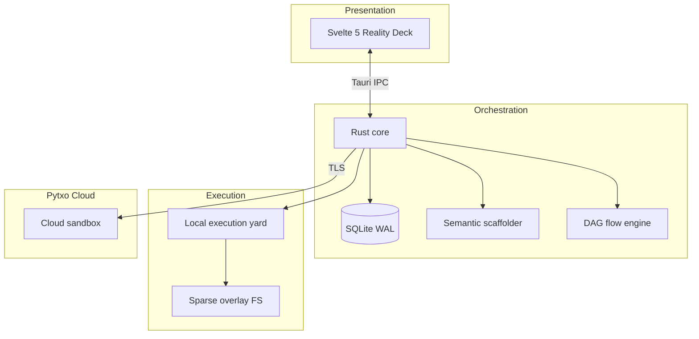

# Container diagram (C4 L2)

```mermaid
flowchart TB
  subgraph presentation [Presentation]
    ui[Svelte 5 Reality Deck]
  end
  subgraph orchestration [Orchestration]
    core[Rust core]
    wal[(SQLite WAL)]
    scaffold[Semantic scaffolder]
    dag[DAG flow engine]
  end
  subgraph execution [Execution]
    yard[Local execution yard]
    overlay[Sparse overlay FS]
  end
  subgraph cloud [Pytxo Cloud]
    sandbox[Cloud sandbox]
  end

  ui <-->|Tauri IPC| core
  core --> wal
  core --> scaffold
  core --> dag
  core --> yard
  yard --> overlay
  core -->|TLS| sandbox
```

See [three-tier-model](/docs/three-tier-model) for narrative detail.
