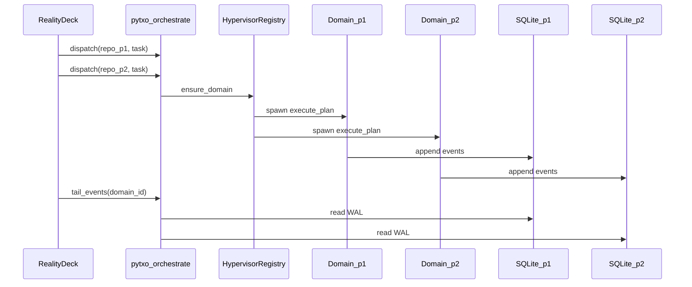

# Execution domains and hypervisor registry

Pytxo’s **productivity max** goal: run independent agent swarms on **different project directories** at the same time—e.g. `/project1` “Fix bug” and `/project2` “Deploy theme”—without blocking the Pytxo Desktop or leaking scheduler, registry, or log state between repos.

An **execution domain** is the unit of isolation for one canonical repo root. A **hypervisor registry** holds all active domains for the local control plane process.

**Modular projects (shipped v1):** user-facing **projects** may attach **multiple path roots** to one logical workspace (Antigravity-style). See [[modular-projects]].

**Fleet DAG (shipped):** cross-**repo** barriers via [[hypervisor-fleet-dag]] — explicit fleet manifests, not implicit multi-repo `depends_on`.

ADR: [[ADR-0008-local-permission-profile-four-tiers]].

## Reference structures (`pytxo-orchestrate::hypervisor`)

```rust
/// Stable id: hash of canonical `repo_root` (see `path_util::canonical_repo_root`).
pub struct DomainId(pub String);

pub struct ExecutionDomain {
    pub id: DomainId,
    pub repo_root: PathBuf,
    pub data_dir: PathBuf,              // typically {repo}/.pytxo/data
    pub permission_profile: PermissionProfile,
    // Owned per domain — never shared across domains:
    pub store: PytxoStore,              // separate pytxo.db per data_dir
    pub swarm: SwarmRegistry,           // Race Shield claims scoped to this repo
    pub run_handle: DomainRunHandle,    // tokio JoinSet + cancel token
}

pub struct HypervisorRegistry {
    domains: HashMap<DomainId, ExecutionDomain>,
}
```

## Non-blocking multi-project rules

1. **Dispatch** — Each `pytxo run --repo /path` (or hypervisor `dispatch` IPC) calls `HypervisorRegistry::ensure_domain(repo_root)` then spawns `execute_plan` on an independent async task.
2. **Telemetry** — PTY stdout/stderr collectors append only to **that domain’s** `events` table. No shared in-memory line buffer across domains.
3. **Scheduling** — `pytxo-scheduler` builds waves **per domain** per run. Cross-repo ordering uses [[hypervisor-fleet-dag]] (fleet manifest + barrier sync).
4. **UI polling** — Pytxo Desktop uses `list_domains` → `tail_events(domain_id, …)`. Never a single global interleaved stream ([[presentation-passive-telemetry]]).



## Relationship to crates today

| Component | Status |
|-----------|--------|
| `HypervisorRegistry` | **Shipping** — `ensure_domain`, `run_blocking`, `dispatch`, `list_domains`; `default_hypervisor()` singleton |
| `pytxo-orchestrate::run` | Uses registry; one store per domain `data_dir` |
| `pytxo-runner::execute_plan` | Per-domain `SwarmRegistry` + `ProcessRegistry` |
| `PytxoStore` | `{data_dir}/pytxo.db` per repo root; WAL per file |
| `dispatch` | Non-blocking `tokio::spawn` of `execute_run_body` (dry-run registers domain only) |

## SQLite WAL separation

### v1 (documented baseline)

- **Domain ≡ repo** with separate `data_dir` → separate `pytxo.db` files.
- `runs.repo_root` column already records root; IPC passes `domain_id` so the UI selects the correct DB path via orchestration (never opens files directly).

### v2 (global catalog — shipped)

- `~/.pytxo/hypervisor.db` holds a `domains` table (`domain_id`, `repo_root`, `db_path`, `project_id`, `status`, `updated_at`). `pytxo_store::Catalog` owns the schema.
- Every `ensure_domain` upserts the catalog (best-effort, never fatal). `pytxo domains [--json]` and the Tauri `list_all_domains` command read it.
- The Pytxo Desktop "All projects" home lists catalog rows; selecting one tails that domain's own `pytxo.db`. **Streams are never merged** — the catalog only records where each per-domain DB lives.
- `list_domains_status` / `pytxo domains` expose `active_runs`, `latest_run_status`, and in-process `hitl_pending` per domain.

### Fleet runs (v3)

- `fleet_runs` and `fleet_nodes` tables record hypervisor-level cross-repo DAG execution ([[hypervisor-fleet-dag]]).

### Write contract

- Event append paths must include `domain_id` (or resolve DB from domain) at write time so lines from project A and B **never** share one `events` stream.
- [[sqlite-wal-logging]] describes the per-domain audit model.

## State leakage prevention

| Shared resource | Rule |
|-----------------|------|
| `SwarmRegistry` / path claims | Per domain |
| Worktree base | Under domain `repo_root` / config `worktree_dir` |
| Process registry file | Per `data_dir` (already `registry_path(&ctx.data_dir)`) |
| Environment for child PTY | Built per agent inside domain; no cross-domain env reuse |
| Permission profile | Stored on domain; IPC mutations validated against it |

## IPC surface (orchestration)

Extended commands (see [[phase-2-reality-deck]]): `list_domains`, `dispatch`, `commit_workspace`, `hitl_respond`. All are **inputs** to orchestration; the UI does not write the filesystem ([[ADR-0001-three-tier-rust-svelte-tauri]]).

## Positioning

Multi-domain hypervisor behavior is why Pytxo is an **agent hypervisor**, not a single-repo script runner ([[agent-os-vs-virtual-workspace]], [[product-vision]]).

Back: [[architecture-index]] · [[permission-profile-engine]]
