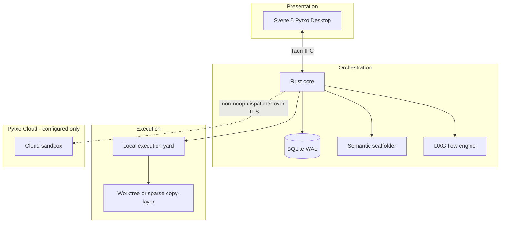

# Container diagram (C4 L2)

The dashed Cloud edge is absent on the default `NoopCloudDispatcher` path.
Kernel FUSE / ProjFS remains a north star; the shipping overlay path is the
sparse copy-layer. See [[three-tier-model]], [[hybrid-execution]], and
[[sparse-overlay-fs]] for narrative detail.
