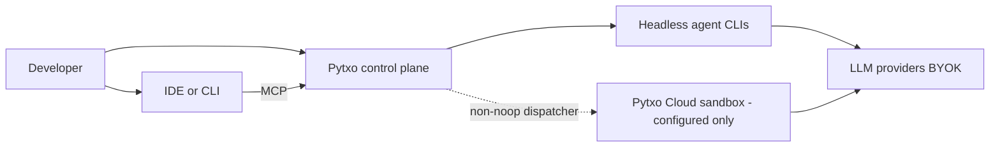

# System context (C4 L1)

Pytxo sits between the developer’s environment and parallel agent processes.
The dashed Cloud path exists only when a non-noop dispatcher is configured;
local execution is the default ([[hybrid-execution]]).
