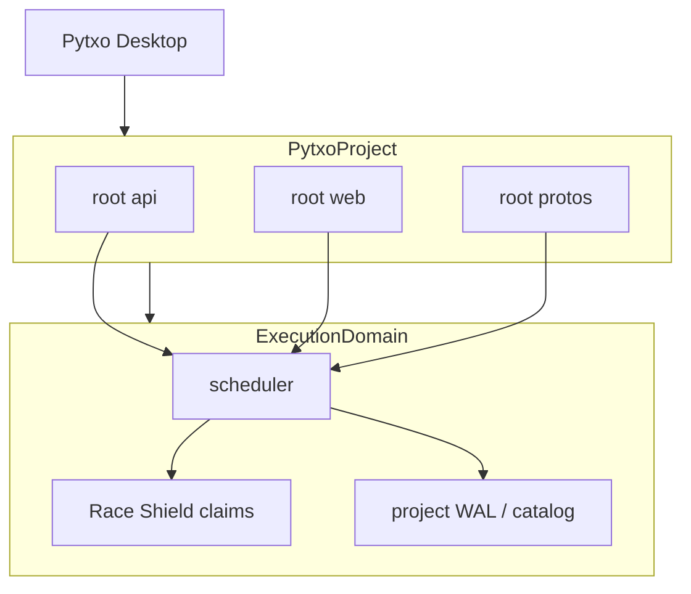

# Modular projects (multi-path workspaces)

Pytxo’s **projects system** is **modular**: you define a **project** once, then grant it access to **one or more folders or repository roots**—not only a single `repo_root`. The model is inspired by **multi-root workspaces** in tools such as [Google Antigravity](https://antigravity.google/) (several directories in one agent context), adapted to Pytxo’s hypervisor, shields, and WAL telemetry.

## Status

| Layer | Shipped (v1) | Target (v2) |
|-------|--------------|-------------|
| Manifest | `ProjectManifest` (`[project]` + `[[roots]]`), discovery + validation ([[ADR-0011-modular-project-manifest]]) | Richer per-root policy overrides |
| CLI | `pytxo project init \| list \| paths \| run` | `pytxo project status` aggregating roots |
| Dispatch | `project run` — **one `run_id`**, tasks use `root = "label"` for other writable roots | Cross-project DAG |
| Telemetry | Runs tagged with `project_id` + `root_id` (store migration 004) | Project-scoped catalog DB |
| Pytxo Desktop | Workspace Home + folder tabs | Multi-root Workspace settings (`ProjectPathPanel`) |

**v1 shipped:** a project groups multiple folders; `pytxo project run` executes **one coordinated run** on the primary domain with `task.root` routing and `agents.root_id` telemetry. Read-only roots can be merged into agent context. Single-repo users are unaffected — no manifest means behavior is identical to `pytxo run`.

**v2 shipped (Phase 66 + Desktop Workspaces):** `project_roots` in hypervisor catalog; Desktop Workspace Home lists projects/domains; multi-root tabs open via `list_projects` + `ProjectPathPanel` add/remove; cross-project fleet DAG via `pytxo fleet` (Phase 23). In the UI, a modular project is called a **Workspace**.

## Concepts

### Pytxo project

A **project** is a named, persistent workspace that groups:

- **Path roots** — absolute directories the project may use (monorepo root, sibling service repo, shared `packages/`, design assets folder, etc.).
- **Primary root** — default cwd for dispatch and for `pytxo.toml` resolution when a root contains config.
- **Policy** — one [[permission-profile-engine|permission profile]] and billing domain for the project unless overridden per root.
- **Telemetry channel** — one logical run stream in Desktop for “this project,” even when agents touch multiple roots.

### Path root

A **path root** is one entry on the project’s allowlist:

```toml
# Illustrative project manifest (format TBD)
id = "acme-platform"
name = "Acme Platform"

[[roots]]
path = "/home/dev/acme-api"
label = "api"
primary = true

[[roots]]
path = "/home/dev/acme-web"
label = "web"

[[roots]]
path = "/home/dev/shared-protos"
label = "protos"
read_only = true   # optional: scaffold/read only, no Blast flush
```

Rules we intend to enforce:

- Every agent task path must resolve **under** some declared root (after canonicalization).
- **Race Shield** claims are scoped to `(project_id, root_id, relative_path)` so two agents cannot collide across the union.
- **Blast Shield** worktrees/overlays are created **per root** (or per task), with explicit approve-to-flush per root when policy requires it.

### Why modular (vs many separate domains)

| Approach | Good for | Limitation |
|----------|----------|------------|
| **Multiple execution domains** (v1) | Unrelated repos in parallel (`/project1`, `/project2`) | No first-class “one brief, three folders” workspace |
| **Modular project** (target) | Full-stack / polyrepo work in one swarm | Requires cross-root DAG, claims, and telemetry design |

**Productivity max** ([[product-vision]]) keeps both: many **projects** can run at once, and each project may include **many path roots**.

## Antigravity-style inspiration (not a clone)

Antigravity-style IDEs treat the workspace as **several folders the agent may see together**. Pytxo maps that to the **orchestration tier**, not a GPU terminal wall:

| Antigravity-style idea | Pytxo mapping |
|------------------------|---------------|
| Multi-folder workspace | Project `roots[]` |
| Agent sees multiple trees | Signal Core scaffold per root; MCP reads resolve root + relative path |
| User adds/removes folders | Project manifest edit + Deck “Manage paths” |
| Single chat / task spanning repos | One `run_id` under `project_id`; waves may schedule agents on different roots |

Pytxo still runs **headless PTY agents** and optional [[desktop-visual-system]] telemetry—it does not host the Antigravity UI or Google’s agent runtime.

## Orchestration sketch



1. **Dispatch** — `ensure_project(project_id)` loads roots, picks primary for config, registers one domain (or a project-scoped domain id).
2. **Tasks** — `pytxo.toml` `[[task]]` paths are relative to a **root label** (e.g. `root = "api"`, `paths = ["src/..."]`) or default primary.
3. **Telemetry** — Events record `project_id`, `root_id`, and `agent_id` so Desktop can filter by folder without merging unrelated projects.
4. **Storage** — v2 option: single `pytxo.db` per project under `~/.pytxo/projects/<id>/` with a `roots` table; v1 interim: primary root’s `.pytxo/data` plus metadata sidecar (see global catalog notes in [[execution-domains]]).

## Moats across multiple roots

| Moat | Multi-root behavior |
|------|---------------------|
| [[signal-core]] | Scaffold paths resolved per root; cross-root imports documented in scaffold metadata when detectable |
| [[blast-shield]] | Isolation per agent per root; “Approve merge” may list roots with pending flush |
| [[race-shield]] | Claims never span roots unless a task explicitly declares multi-root paths; stdin/PTY per agent unchanged |

## Pytxo Desktop (shipped UX — Phase 66+)

- **Workspace Home** — lists projects/domains; multi-root tabs via `list_projects` + `ProjectPathPanel`.
- **Path panel** — roots with labels, read-only badge.
- **Topology** — nodes colored by `root_id` (Phase 63).
- **Logs** — filter by root / agent; poll cursor keyed by domain/agent.

## CLI (shipped v1)

```bash
pytxo project init acme-platform --name "Acme Platform" --add /path/to/api --add /path/to/web
pytxo project paths --id acme-platform --add /path/to/protos --read-only
pytxo project list --id acme-platform
pytxo project run --id acme-platform --cmd "claude" --agents 3
```

`project run` executes once on the primary root and prints a single `run_id` plus the writable root labels included. Use `pytxo project status` to list recent runs with per-root agent counts. `--manifest <file>` works in place of `--id`; with neither, Pytxo looks for `.pytxo/project.toml` under the cwd.

MCP read/scaffold tools accept optional `project_id` + `root` for cross-root file access.

## Relationship to execution domains

- **v1:** [[execution-domains]] — `DomainId` = hash of one `repo_root`; use multiple domains for multiple unrelated repos.
- **v2:** **Project** is the user-facing module; **domain** is the runtime isolation unit that may own **multiple canonical roots** under one `project_id`.

Do not conflate **Pytxo project** with a customer’s application repository on GitHub—those stay in the user’s org. **Pytxo-dev** hosts only product code ([[github-organization]]).

## Resolved design questions (Phase 17)

These were resolved in the [[ADR-0011-modular-project-manifest|ADR-0011]] Phase 17 amendment:

- **Worktrees across different repos:** one worktree per root per agent. Independent repos stay independent; submodule consolidation is not pursued.
- **Non-git paths:** allowed for assets/scaffolding; Blast **sparse copy-layer overlay** works on non-git trees when `isolation = overlay` or `prefer_kernel_overlay` upgrades (Phase 69). Full kernel ProjFS/FUSE virtualization remains north star.
- **Cross-root `depends_on`:** permitted within a single run with explicit edges across `root` labels (scheduler uses one `run_id` on the primary domain).

`task.root`, root-scoped Race claims, and `agents.root_id` / catalog `project_id` telemetry shipped in Phase 17. Track remaining work in [[mvp-bootstrap]].

Back: [[product-vision]] · [[execution-domains]] · [[MOC-home]]
