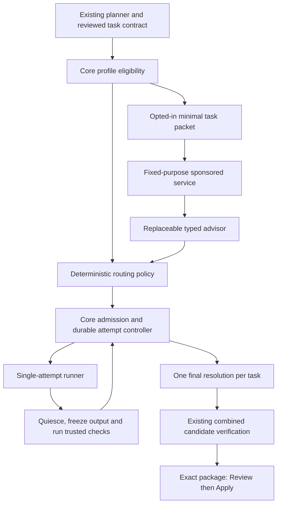

# Pytxo Jev routing and orchestration v1

**Recommendation:** one local, Core-owned attempt controller, deterministic admission and recovery, and a replaceable advisor for a narrowly defined semantic routing decision. Start by testing whether Jev improves initial everyday-versus-strong profile selection. Ship rules-only if it does not.

This second-pass proposal supersedes the broader first draft in this file. It is implementation-ready at the contract and work-package level, not implemented or approved for deployment. The user chose **workspace opt-in for a small redacted hosted packet**, with local rules available by default. All other numeric defaults are proposals.

## Scope that matches the repository

| Stage | Scope and activation gate |
|---|---|
| V1a: first experiment | One repository/domain, local PTY, Orbit, Codex, one worker. Two explicitly qualified model/settings recipes in that harness. Rules control retries; Jev may influence only initial profile selection. Existing Desktop Beta restrictions remain. |
| V1b: separately qualified extension | A second harness and at most two workers using the existing DAG waves, frozen handoff bundles and shared local capacity admission. Galaxy or an optional local model requires its own enforcement/runtime evidence. |
| Later, evidence-dependent | Jev failure classification, skill-bundle selection, dependency suggestions during planning, more profiles or scheduling optimization. None is necessary to establish initial routing value. |

A profile named Sol or Astra is not evidence that an installed CLI can select it. Before the benchmark, record two real launch recipes, billing bindings and observations. If a harness supports only one qualifying recipe, use manual/rules behavior there. Do not silently substitute a model.

The existing generative planner continues to create task text and proposed dependencies. Its usage stays separate from routing subsidy. No always-running manager, dynamic graph rewrite, autonomous tool installation, model downloader, distributed scheduler or generic effect platform is required.

## Architecture

Core owns eligibility, authorization, secrets, cost permits, task/attempt state, dependencies, resource slots, checks, candidate identity and Apply. Jev returns bounded semantic evidence. The sponsored service owns only admission to Pytxo-funded inference. Neither can grant local execution authority.

Use the existing per-domain active-run owner. The proposed controller owns routed task transitions; the runner executes one attempt and reports typed observations. Do not wrap the current complete wave runner in another orchestration loop. Details: [[2026-09-22-jev-routing-contracts]].

## Profile and policy decisions

Separate an immutable **ExecutionProfile recipe**, a local **ProfileBinding**, fresh **ProfileObservation**, and the reviewed **TaskContract/MissionAuthorization**. Credentials, instantaneous capacity and required verification do not belong inside a reusable recipe.

The launch descriptor binds exact adapter/executable identities and settings after eligibility checks. Model identity has explicit evidence levels: requested, harness-reported or provider-attested. Missing usage is unknown. This avoids both fictitious certainty and requiring an attestation the harness cannot produce.

V1a fixes the approved skill/tool bundle before routing. The only Jev question is whether the bounded task's demands fit everyday execution, warrant stronger investigation, or are unclear. It cannot name arbitrary profiles, suggest commands or waive checks. A versioned pure policy maps that signal to one of the already authorized choices. Deterministic blockers win first; missing or stale advice gives the same rules route. See the exact ordered policy in [[2026-09-22-jev-routing-contracts]].

One admitted attempt plus one additional attempt per task remains the cap. All launches, including failed startup and the runner's existing Signal retry, must be accounted for. For routed execution the hidden Signal retry is disabled; useful richer-context retry behavior moves into the explicit second attempt. Manual execution retains its current behavior.

## Dependencies, transfer and authority

Keep precomputed waves and reviewed graph edges. V1 does not use Jev to rank ready work. Independent tasks in a wave can proceed within the reviewed worker/resource limit; failed prerequisites block descendants, while unrelated tasks continue. A successful task publishes one immutable output identity. It cannot be reopened after a dependent has consumed it.

A portable handoff is a local, versioned manifest plus content-addressed bytes and evidence. It is not a vendor conversation export. A receiving harness starts a new session in a new sandbox. Failed output is an explicitly untrusted repair input for the same task; only verified task winners become dependencies. See [[2026-09-22-jev-routing-handoff]].

The existing prepared-package digest, combined verification, destination freshness checks, human Apply boundary, journal and recovery remain authoritative. Their acceptance predicates need no semantic change. Candidate preparation must receive exactly one successful output per task rather than all historical attempts.

## Routing included

Offer “Pytxo Routing included within the sponsored allowance.” Manual/rules execution stays accountless. An optional free account authenticates hosted routing independently of paid Ultra inference. Users keep their own worker subscriptions/API accounts; local compute and generative planning are not covered.

At the reviewed price, 3,000 input tokens cost $0.000126; 1,000 such decisions cost $0.126. These are arithmetic examples, not observed workload costs. Hosting, retries, abuse and support are extra. [TypeSafe pricing](https://docs.typesafe.ai/models)

Proposed private pilot: 100 invited accounts, 3 million input tokens/account/UTC month, 10 requests/minute/account, 2 in flight/account, and a separately authorized $50 monthly upstream allocation. Limits trigger local fallback without billing the user. [[2026-09-22-jev-routing-service]] defines dedicated authentication, transactional accounting, uncertainty and retention. No money was authorized or spent here.

Keep routing, planning, every worker attempt, handoff/check execution and infrastructure in separate ledgers. An unchanged subscription fee is not savings; strong-model invocations are not a measured quota balance. Compare total completion cost and accepted quality, including failed runs.

## Privacy and replaceability

Workspace consent covers the outgoing task description and coarse facts; preview the actual packet. Local-only overrides it. Do not send credentials, absolute paths, remotes, raw source trees, transcripts, hidden reasoning, environment values or full skill text. Minimal allowlisted construction precedes sanitization. Proprietary intent can still remain in a task description; “redacted” does not mean anonymous.

Consent to hosted routing and optional outcome sharing are separate. Keep detailed local history by default. Provider retention is distinct from Pytxo retention; no-training is not zero-retention. [TypeSafe legal documentation](https://docs.typesafe.ai/legal)

The advisor interface accepts typed signals and supports rules-only operation indefinitely. No Jev dependency belongs in permission, process ownership, verification or Apply. Vendor terms constrain possible downstream learning: independent observed outcomes must remain separate from Jev outputs. [[jev-typesafe-research-2026-09-22]] records that boundary.

## What earns expansion

Start with manual profile qualification and the small packet evaluation before runtime refactoring; an unusable signal should end the experiment cheaply. The concrete protocol in [[2026-09-22-jev-routing-benchmark]] then compares the same controller, profiles, prompts and checks with and without Jev. A 24-task screen establishes feasibility; a separate fixed held-out evaluation tests quality non-inferiority and total cost reduction. Neither packet-classification accuracy nor cheap inference alone establishes product value.

The defensible accumulated asset is versioned, independently checked task/profile outcomes, exact handoff provenance and accepted candidate history. Passive observations have selection bias; cross-harness compatibility and controlled comparisons must be earned separately.

Read [[2026-09-22-jev-routing-stress-review]] for source-backed defects and the required/untouched change map; [[2026-09-22-jev-routing-rollout]] gives ordered implementation packages and acceptance checks. Remaining activation decisions are the actual two profiles, benchmark corpus/spend, provider billing guarantees/data terms, and measured thresholds. They do not block writing the local contracts.
